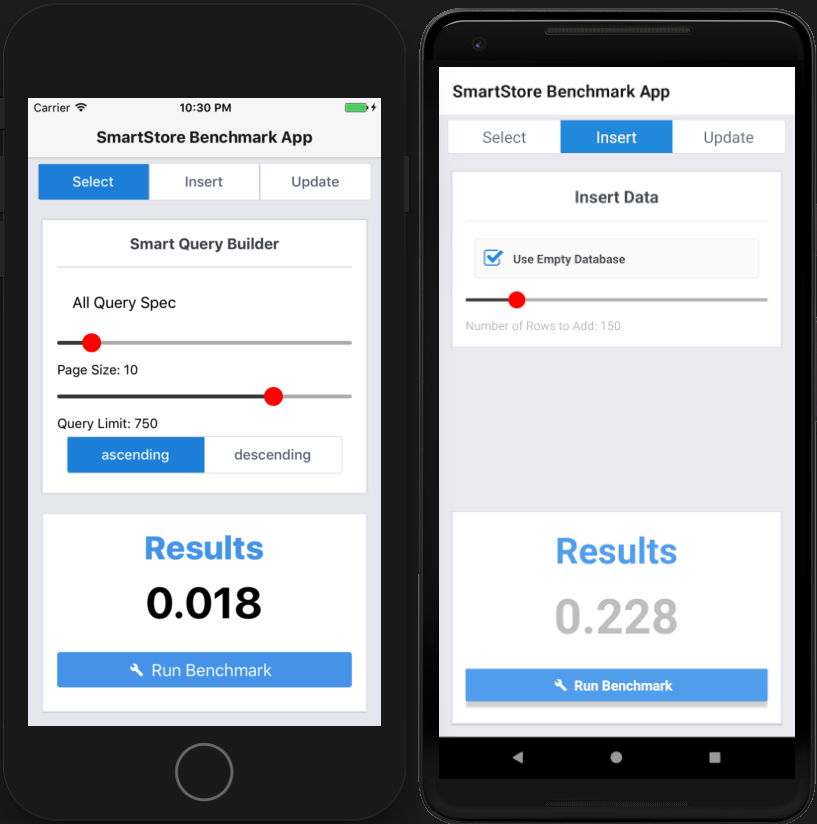

# SmartPerformance

## Features
* Compare iOS and Android.
* Quickly generate and run a complex query through UI.
* Test inserting large amounts of data. 

## TODO
* Compare Native Performance to React Native Performance.
* Benchmark Upsert.
* Quickly import your own data.
* Sync benchmark results.

## Setup
Run `installios.js` and `installandroid.js`.